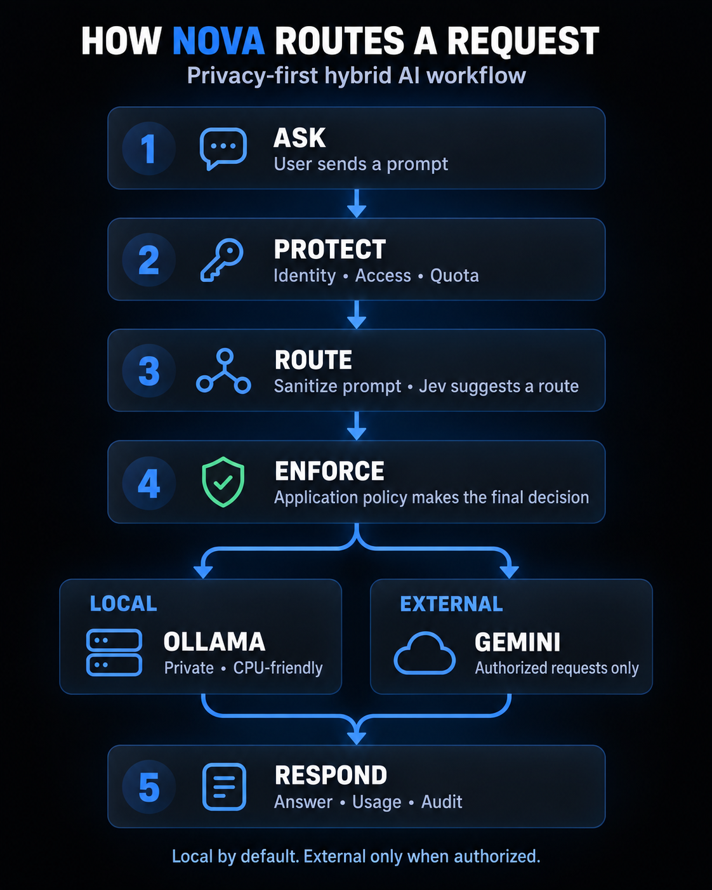
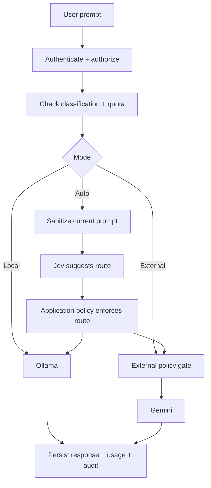

# NOVA — Privacy-First Hybrid AI Platform

<div align="center">

**Route AI requests between a private local model and an authorized cloud model without giving up application-level control.**

[](https://www.djangoproject.com/)
[](https://nextjs.org/)
[](https://www.langchain.com/langgraph)
[](https://www.postgresql.org/)
[](#quality-and-testing)

</div>



NOVA is a multi-project AI chat platform that combines local Ollama inference, Gemini, permission-aware retrieval, and policy-controlled automatic routing. It is designed around one principle: **local by default, external only when authorized**.

The application—not the routing model—owns security decisions. Jev may suggest whether a request is better suited to local or external inference, but deterministic project, identity, classification, availability, and quota rules make the final decision.

## Highlights

| Capability | What NOVA provides |
| --- | --- |
| Hybrid inference | Explicit `local`, `external`, and policy-controlled `auto` modes |
| Safe auto-routing | Sanitized Jev decisions through OpenRouter with local-first failure behavior |
| Private local execution | CPU-friendly Ollama support using `qwen2.5:0.5b` for the initial test setup |
| Authorized cloud execution | Gemini access gated by project, member, classification, and provider policies |
| Permission-aware RAG | PostgreSQL + pgvector retrieval filtered before ranking by project and access policy |
| Multi-project isolation | Django authentication, memberships, roles, clearance levels, and project groups |
| Usage governance | Project, profile, group, and provider request/token quotas |
| Operator control plane | Django admin for users, access, models, providers, knowledge bases, and quotas |
| Traceability | Private conversation history, source lineage, usage accounting, and metadata-only audit events |

## How a request flows



For `auto`, NOVA sends only a sanitized copy of the current message to Jev. Conversation history, system prompts, retrieved documents, and RAG context are excluded. Detected credentials force local-only execution.

## Technology

**Frontend**

- Next.js 16, React 19, TypeScript, and Tailwind CSS
- Motion for restrained interface transitions
- Lucide React icons

**Backend**

- Django 6 and Django REST Framework
- LangChain model integrations and LangGraph workflows
- PostgreSQL 17 with pgvector
- Ollama for local inference and embeddings
- Gemini for optional external inference
- OpenRouter Jev Decisions for automatic route preference

## Project structure

```text
frontend/                Next.js desktop-first chat interface
chatbot/
  chatbot/               Django settings and root routing
  projects/              tenants, projects, profiles, groups, policies
  providers/             model adapters, registry, routing, LangGraph workflows
  knowledge/             ingestion, embeddings, authorization-aware retrieval
  chat/                   conversations, API, orchestration, web views
  usage/                  quota reservation and accounting
  audit/                  metadata-only security events
docs/                     architecture, API, and implementation notes
```

## Quick start

### Prerequisites

- Python 3.13+
- Node.js 22+
- Docker Desktop
- Ollama, either installed on the host or started with the Compose `local` profile

### 1. Configure the environment

```powershell
Copy-Item .env.example .env
python -c "import secrets; print(secrets.token_urlsafe(48))"
```

Put the generated value in `DJANGO_SECRET_KEY`, choose a local PostgreSQL password, and set a 12+ character `DJANGO_TEST_USER_PASSWORD`. Keep `.env` local; it is excluded from Git and Docker build context.

### 2. Start PostgreSQL and Ollama

```powershell
docker compose --profile local up -d db ollama
docker compose exec ollama ollama pull qwen2.5:0.5b
```

CPU inference is supported but may be slow. RAG additionally needs the embedding model configured by `EMBEDDING_MODEL`—`nomic-embed-text` by default.

### 3. Start Django

```powershell
python -m venv .venv
.venv\Scripts\Activate.ps1
python -m pip install -r requirements-dev.txt
python chatbot/manage.py migrate
python chatbot/manage.py seed_test_access
python chatbot/manage.py seed_demo --username test-admin
python chatbot/manage.py runserver
```

The idempotent development seeder creates `test-admin`, `test-editor`, and `test-reader`. Their password comes from `DJANGO_TEST_USER_PASSWORD` and is never printed.

### 4. Start the Next.js interface

```powershell
Copy-Item frontend/.env.example frontend/.env.local
Set-Location frontend
npm install
npm run dev
```

- Application: <http://localhost:3000>
- Django API: <http://localhost:8000/api/>
- Operator admin: <http://localhost:8000/admin/>

## Model configuration

### Local

The demo configuration uses `qwen2.5:0.5b`, chosen as a small CPU test model. Ollama is treated as a private deployment endpoint and should not be exposed publicly.

### Gemini

Set `GOOGLE_API_KEY` in `.env`, restart Django, and enable the external provider/model through the operator admin or scoped project API. External execution also requires:

1. Project-level external processing permission.
2. A compatible project classification ceiling.
3. Member-level external permission.
4. An enabled and available provider/model configuration.

### Jev automatic routing

Set `OPENROUTER_API_KEY` to enable `typesafe/jev-1.13`. Missing credentials, timeouts, malformed responses, or low-confidence decisions safely prefer local execution. Jev chooses a preference; it cannot bypass authorization or quota enforcement.

## Administration and quotas

The Django admin is the trusted operator control plane. Superusers can manage:

- users and project profiles;
- groups and access policies;
- local knowledge bases;
- providers, models, and agent configuration;
- project, profile, group, and provider quotas.

Quota pages show current request and token consumption. Conversations, messages, usage records, vector chunks, and audit events are intentionally read-only to protect operational history.

## Security model

- Every request requires an active Django identity and project membership.
- Tenant and project scope come from the database, never a client-supplied tenant header.
- Roles, clearance, classification, and group policies are checked before retrieval and inference.
- Retrieved chunks are authorization-filtered in the database before similarity ranking.
- Provider secrets remain in environment configuration and are never stored in project rows.
- Audit records exclude prompts, responses, credentials, headers, and vectors.
- External fallback is forbidden when credential-like content is detected.
- Provider errors are sanitized before reaching clients or logs.

See [the architecture and threat model](docs/architecture.md) for the complete design.

## API

The authenticated REST API covers projects, profiles, groups, policies, providers, models, agents, quotas, knowledge bases, documents, conversations, and chat.

```http
POST /api/chat/
Content-Type: application/json

{
  "project_id": 1,
  "message": "Explain our onboarding policy",
  "mode": "auto"
}
```

See the [API guide](docs/api.md) for endpoints, roles, payloads, and error behavior.

## Quality and testing

```powershell
python -m pytest -q
ruff check chatbot
ruff format --check chatbot
python chatbot/manage.py check --settings=chatbot.test_settings
python chatbot/manage.py makemigrations --check --dry-run --settings=chatbot.test_settings

Set-Location frontend
npm run lint
npm run typecheck
npm run build
```

Current portable suite: **68 passed, 1 skipped**. The skipped case validates real PostgreSQL row-lock behavior and runs in the PostgreSQL integration environment and CI.

## Documentation

- [Architecture and security decisions](docs/architecture.md)
- [REST API guide](docs/api.md)
- [Implementation and verification record](docs/implementation.md)
- [Detailed architecture poster](design/nova-architecture-linkedin.png)

## Roadmap

- Transactional streaming over SSE
- Asynchronous document ingestion and more file extractors
- Background provider health checks and circuit breakers
- Per-project embedding configuration and reranking
- Idempotency keys for safely retrying chat requests
- A dedicated project-administration interface beyond Django admin

---

<div align="center">

**NOVA — local by default, external only when authorized.**

</div>
