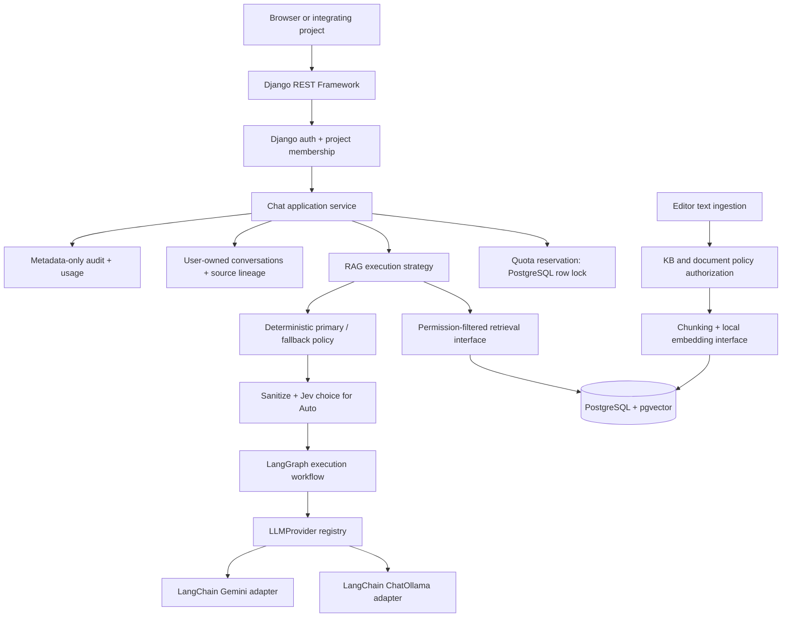

# Architecture and security decisions

## Repository assessment before implementation

The repository contained Django 6.0.6, Python 3.13, one `chat` app, a dark Nova chat interface, an initial migration for conversations/messages, a SQLite database, and an import-time LangChain/Gemini agent. There were no dependency manifests, useful tests, Docker files, or documentation. Git had no commits; existing files were untracked user work.

Reusable pieces: Django project entry points, installed Django authentication/session tables, the chat UI/CSS, and conversation/message migration history. Conflicts: source `Conversation.user` referenced an unmigrated custom plaintext-password `User`; the actual database had no conversation owner column. Login printed submitted credentials and did not establish a Django session. Model calls required a key during module import and had a hardcoded user-information tool. Four conversations and eight messages existed without provenance.

The implementation keeps the existing project/app and migration, removes the incomplete auth/provider path, and quarantines unassigned history. It does not change or migrate the user's original database during implementation. Separating service concerns into new apps is additive; there is no irreversible bulk data conversion.

## Components



```text
chatbot/
  chatbot/       environment settings, root URLs, ASGI/WSGI
  projects/      tenants, projects, membership, groups, policies, config serializers
  providers/     configs, LangChain adapters, LangGraph execution, registry, deterministic router
  knowledge/     KBs, documents, chunks, embeddings, ingestion, retrieval interface
  chat/          conversations, HTTP APIs, RAG agent, orchestration, history, web UI
  usage/         quotas, atomic reservations, usage accounting
  audit/         security-event model and metadata allowlist
```

Policies and agents are Python modules rather than extra Django apps. No custom user model, profile table, general policy engine, agent subclasses that duplicate behavior, vector-database client, or async queue is needed for this MVP.

## Data relationships

| Model | Ownership / purpose |
| --- | --- |
| Django User | Hashed credentials; sessions/API tokens; membership in multiple projects |
| Tenant | Organization grouping projects |
| Project | Tenant FK; enabled flag; default sensitivity; external permission and ceiling |
| Membership / profile | Unique project/user; active state; role; clearance; external permission; project groups |
| ProjectGroup | Named group unique within project |
| AccessPolicy | Project; role floor; clearance floor; classification; optional group allowlist |
| ProviderConfig | Project provider allowlist entry; deployment connection alias; enabled/available flags |
| ModelConfig | Project/provider FK; allowed model name; input/output budgets; enabled/capability flags |
| AgentConfig | One per project; primary/fallback models; prompt; RAG flag; retrieval/context bounds |
| KnowledgeBase | Project and access policy |
| Document | Project, KB, own policy, embedding-model identity; title; creation time |
| DocumentChunk | Document FK, ordinal, text, `vector(768)` embedding |
| Conversation | Project/user; private history; generic title; legacy null ownership is inaccessible |
| ChatMessage | Role/content; classification; cumulative source document IDs |
| Quota | Project, optional user OR group OR provider; minute/day requests and daily tokens |
| UsageRecord | Project/user/provider/conversation; group snapshot; reservation, status, measured token totals |
| AuditLog | Project/user/event/time; allowlisted metadata only |

FKs and compound indexes support project, user, policy, time, and document filtering. Explicit uniqueness/check constraints cover memberships, model/provider names, chunk ordinals, and quota scopes. Chunk tenant/project/KB/policy metadata is normalized through indexed FK joins instead of copied into mutable JSON. Source IDs in messages deliberately survive document deletion so deletion cannot erase authorization lineage.

## Access semantics

1. A request must authenticate as an active Django user.
2. Resolve the URL/body project ID through an active membership in an enabled project. Its tenant comes from the database, never a client header or payload claim.
3. Roles are reader (0), editor (1), administrator (2). Readers chat/read their private history; editors ingest; project administrators configure permissions/providers/quotas. Admin role does **not** bypass clearance or document group requirements.
4. Both the KB policy and document policy must belong to the same project, have `minimum_role <= membership.role`, `access_level <= clearance`, and `classification <= clearance`. An empty group list admits all otherwise-authorized project members; a nonempty list requires membership in at least one listed project group.
5. Build these predicates from membership and use an authorized-document SQL subquery inside the chunk query **before** ordering by distance and limiting results. A prompt cannot modify the filter, pick a different principal, run a query, or invoke a retrieval tool.
6. Requested KB IDs can only narrow this set. Explicit unauthorized IDs fail before embedding.
7. Every assistant response retains the union of source document IDs from its context and prior history. History access and reuse validate the entire source lineage against current policies. Deleted/restricted sources block the conversation; users must start a new one. Reclassification increases the routing sensitivity even for previously generated text.

Application APIs validate cross-project configuration references. Retrieval and routing also check scope independently, so a malformed row inserted through an operator script fails closed. Django ORM `save()` itself does not call `full_clean()`; trusted management scripts must do so or maintain the same invariants. Direct database access and superuser operations are outside the tenant threat boundary. PostgreSQL RLS is a possible additional defense, not claimed by this MVP.

## Chat flow and routing

Authenticate → resolve membership → validate request sensitivity, requested KBs, and private conversation → load project agent → check initial permitted candidates → reserve a conservative context-window budget → validate/read recent history → retrieve authorized chunks using local query embeddings → assemble context → recompute sensitivity → choose first permitted primary/fallback → check provider quota → recheck access → invoke adapter → recheck access after generation → transactionally persist message pair, usage and completion audit.

Sensitivity is the maximum of project default, client-declared value, conversation lineage, KB classification, and retrieved-document classification. Clients can raise the floor but cannot lower the project/source classifications. Project default must also cover the system prompt and expected user-supplied data; automatic classification of arbitrary pasted text is not claimed.

Each route decision returns `allowed` and a stable reason. Checks include project ownership, membership/project activity, enabled/available model/provider, configured connection mode, requested local/external mode, user clearance, and all external permissions. Known cloud model names are rejected for local routing, and the packaged Ollama service disables cloud execution. Deployers must also prevent remote forwarding at independently managed local servers.

Provider failures may try only the configured fallback after repeating the policy and quota checks. A provider marked unavailable is skipped; live transport failures are sanitized and audited. Health probes exist on the interface but are not sent for every chat. For `auto`, a LangGraph routing workflow sanitizes the current message and asks Jev for one typed choice between local and external. That choice only changes candidate order; deterministic authorization, classification, quota, availability, and explicit-mode rules remain authoritative. Missing, failed, malformed, or low-confidence Jev routing prefers local. Detected credentials make the automatic route local-only.

Authorization is checked at admission and just before dispatch, then checked again before delivery. In-flight requests use an authorization snapshot: a provider call already sent cannot be recalled by a later revocation. The post-call check withholds a response when access changed. There is no distributed cancellation or lock held across the network call.

## Interfaces and RAG

`LLMProvider.generate(messages, max_tokens)` returns `Generation(text, input_tokens, output_tokens)`; `stream()` yields transport deltas; `health_check()` returns availability; `estimate_tokens()` supplies a conservative UTF-8-byte estimate plus message framing. `Turn` and `Generation` do not expose provider formats. Registry factories create LangChain `ChatOllama` or `ChatGoogleGenerativeAI` adapters from trusted deployment aliases. One LangGraph workflow performs sanitized automatic routing and another invokes the already-authorized provider. Additional adapters can register without changing retrieval or the chat service.

`RAGAgent` owns retrieval and context construction and executes through the provider abstraction. Its strategy is identical for local and API models, so separate `LocalAgent`/`APIAgent` subclasses would duplicate code. `EmbeddingProvider` and `Retriever` are independent extension points.

Text ingestion is editor-only, accepts at most 200,000 characters, rejects empty/null-byte content, chunks at 1,200 characters with 150-character overlap, embeds in local batches of 16, validates dimension/finite/nonzero vectors, and writes documents/chunks atomically. This is text extraction by accepting already-extracted plain text or Markdown; PDFs, Office documents, websites, and uploads require future extractors. There is no parser invocation or URL fetching in the MVP.

Retrieval defaults to four chunks with a 12,000-character context ceiling. Chunk embeddings carry their model identity through the document. Changing the model requires re-ingestion; mismatched embeddings are excluded. A schema migration and re-ingestion are required to change 768 dimensions. PostgreSQL uses exact `CosineDistance`; no approximate index is used, avoiding recall surprises with small filtered datasets. SQLite's explicitly enabled development fallback sorts already-authorized chunks in memory. Hash embeddings are used only in test settings and are not semantic retrieval.

## Quotas, audit, and failures

The stable project row serializes quota reservations across workers. Every project gets a default limit (20/minute, 500/day, 500,000 tokens/day); optional user, group, and provider quota rows add constraints. Group limits are collective and all groups assigned to a profile apply. Usage records snapshot groups when reserved, preventing later membership changes from rewriting historical group accounting. Daily limits use UTC, minute limits use a rolling 60-second window, and zero means deny. Provider quotas are scoped to a provider configuration within a project, not a global upstream account.

Before retrieval, reserve the largest initially permitted model context budget; this may reject a short request near the daily ceiling. Before dispatch, reduce to the conservative input estimate plus maximum output and recheck all scopes. Successful responses reconcile measured usage. Failures and interrupted/crashed reservations remain charged because upstream completion may still be billed; reservations expire from daily accounting at the UTC boundary. Each attempted fallback consumes another request reservation. Unknown provider tokenizers use conservative byte accounting; adapters should add exact tokenization for precise budgeting. This is an application quota, not an upstream billing guarantee.

429 has a `Retry-After: 60` hint (daily limits may require waiting until UTC midnight); 503 means no permitted working provider, 400 rejects malformed or oversized requests, 401 means no authentication, and 403/404 protect authorization boundaries. Failed calls do not persist partial message pairs. No automatic retry can repeat an external call without quota accounting.

Audit records include request, routing, retrieval IDs, provider selection/error, ingestion, configuration changes, authorization/quota denial, legacy adoption, and completion. The audit helper allowlists metadata keys. There are no prompt/response bodies, headers, credential values, upstream exception messages, or vectors in audit records. Conversation content is intentionally persisted separately and requires its own retention/encryption policy. Operational access logs should never capture bodies, authorization headers, or debug locals.

## MVP and next phases

Delivered: additive Django schema, Django authentication, scoped REST configuration, private history, provider adapters/registry, deterministic router, local embeddings, permission-filtered pgvector retrieval, transactional quota accounting, safe audit events, browser integration, migrations, Docker development/testing setup, seed/adoption commands, and security regression tests.

Deliberately deferred: HTTP token streaming/SSE, async ingestion, additional extractors/providers, embeddings per project, approximate vector indexes, reranking, Redis and login throttling within the app, short-lived/OIDC tokens, global upstream-account quotas, idempotency keys, background health/circuit breakers, advanced ABAC/RLS, tools/workflows, dashboards and a project administration UI. API request retries after a lost response may create a duplicate turn; callers should inspect history before retrying. Exact retrieval, full source-lineage rechecks, and synchronous work are intended for MVP-scale datasets.

Prompt-injection defenses prevent the model from obtaining unauthorized application data; they do not prove that models will follow every instruction, produce factual answers, or avoid revealing authorized context already supplied to them.

## Primary references

- [Django database behavior and SQLite limitations](https://docs.djangoproject.com/en/6.0/ref/databases/)
- [DRF authentication and CSRF](https://www.django-rest-framework.org/api-guide/authentication/)
- [pgvector Django integration](https://github.com/pgvector/pgvector-python)
- [Ollama chat API](https://docs.ollama.com/api/chat) and [embedding API](https://docs.ollama.com/api/embed)
- [Ollama local-only/cloud controls](https://github.com/ollama/ollama/blob/main/docs/faq.mdx)
- [LangChain Ollama integration](https://docs.langchain.com/oss/python/integrations/providers/ollama/)
- [LangChain Google Generative AI integration](https://docs.langchain.com/oss/python/integrations/chat/google_generative_ai)
- [LangGraph graph API](https://docs.langchain.com/oss/python/langgraph/graph-api)
- [OpenRouter Jev Decisions API guide](https://openrouter.ai/blog/insights/what-is-jev/)
